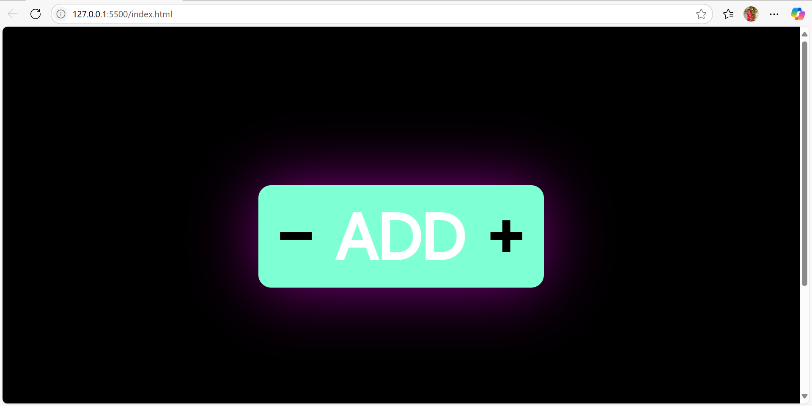

# 🧮 Counter Mini Project using JavaScript

A simple, interactive counter built using **HTML**, **CSS**, and **JavaScript**. This mini project demonstrates DOM manipulation and basic event handling in JavaScript.

## 📂 Project Structure
counter_miniproject-using-js/
├── index.html # HTML markup
├── style.css # Styling for the UI
└── index.js # JavaScript for interactivity

## 💡 Features

- ➕ Increment the counter
- ➖ Decrement the counter
- 🔁 Reset to default
- 💻 Clean, responsive UI
- 🚫 No external libraries used

## 🚀 Getting Started

### Option 1: Open in Browser
1. Download or clone the repository.
2. Open `index.html` in any modern web browser.

### Option 2: Use Live Server in VS Code
1. Install the **Live Server** extension in VS Code.
2. Open the project folder.
3. Right-click `index.html` and choose **"Open with Live Server"**.

## 🛠️ Tech Stack

- HTML5
- CSS3
- JavaScript (ES6+)

## 📸 Screenshot

> ## 📸 Screenshot

## 📌 Author

Made with ❤️ by [Monisha TG](https://github.com/tgmonisha)

---

